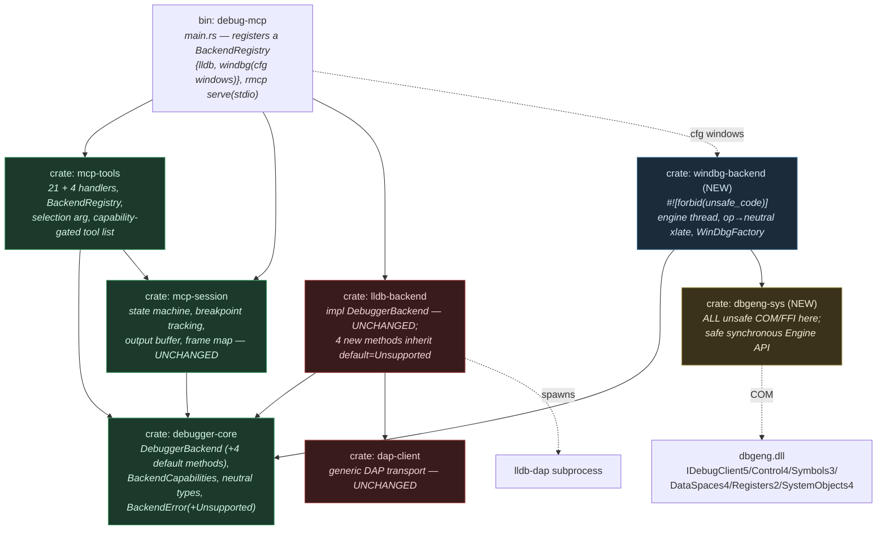
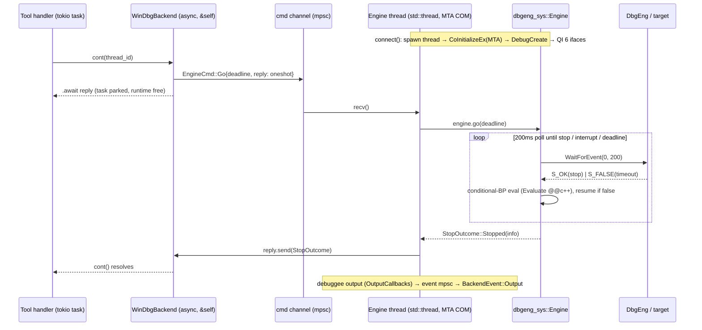
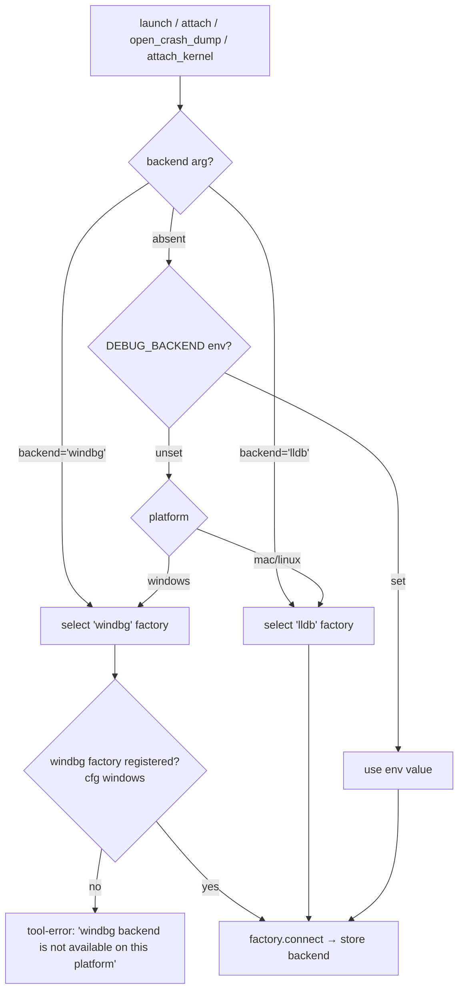
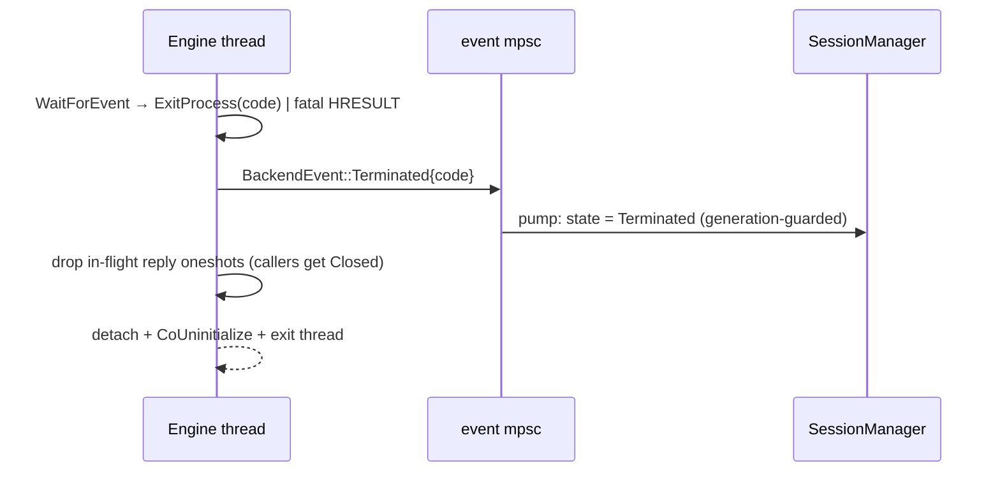
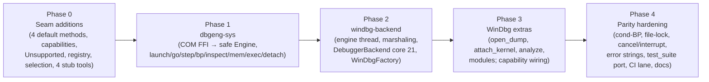

# WinDbg Backend — Technical Design

## Overview

This document is the technical design for adding a **second debugger backend — WinDbg
(DbgEng) — to `debug-mcp`**, the Rust MCP debugging server. It is a **hard port** of the
C++ `windbg-mcp` plugin (`tmp/windbg-mcp-plugin/`, ~3.2k LOC, 24 tools) onto the
existing pluggable `DebuggerBackend` seam established by
[`Designs/RustPort`](../RustPort/README.md).

The RustPort design *anticipated* this work: the seam is already compiler-enforced
(`mcp-tools`/`mcp-session` cannot name a backend type), the trait is already
**coarse + blocking** ("execution returns the next stop"), and the `BackendFactory`
injection point already exists. The C++ analysis confirms WinDbg fits this shape: every
DbgEng engine can "run to the next stop" via `WaitForEvent`. So the bulk of this design
is **net-new crates below the seam**, with three deliberate, additive changes *at and
above* the seam to unlock WinDbg's distinctive capabilities.

**Three confirmed product decisions shape everything below:**

1. **Capability-gated tool expansion.** The 21 lldb tools stay byte-identical. Four new
   neutral tools — `open_crash_dump`, `attach_kernel`, `analyze_crash`, `get_modules` —
   are added and advertised only when a WinDbg-capable factory is registered. WinDbg's
   universal escape hatch (`execute_command`) maps onto the **existing** `run_command`
   tool (raw command → `evaluate(EvalMode::Repl)` → DbgEng `Execute`).
2. **Runtime backend switcher, platform-exclusive registration.** The agent selects the
   backend at the **connect points** (`launch`/`attach`/`open_crash_dump`/`attach_kernel`)
   via an optional `backend` argument; default **WinDbg on Windows, lldb on Mac/Linux**.
   Each OS registers exactly one backend at compile time — `LldbFactory` under
   `cfg(not(windows))`, `WinDbgFactory` under `cfg(windows)`. lldb-on-Windows is deferred; the
   registry/switcher is retained so adding it later is a one-line registration (Decision 7).
3. **Unsafe confined to a `-sys` crate.** A new `dbgeng-sys` crate owns *all* COM/FFI
   `unsafe` (built on Microsoft's official `windows` crate) and exposes a **safe,
   synchronous** `Engine` API. `windbg-backend` and every crate above it stay
   `#![forbid(unsafe_code)]`.

The single hardest implementation constraint, surfaced by the C++ analysis: **DbgEng is
apartment-bound and driven entirely from one OS thread, with blocking `WaitForEvent`
loops.** `windbg-backend` therefore owns a **dedicated engine thread** and marshals async
trait calls to it over channels — the COM analog of `lldb-backend`'s read-loop task.

## Architecture

### Crate topology (the seam is unchanged; two crates added below it)



**Eight crates.** Two are new (`windbg-backend`, `dbgeng-sys`); `debugger-core` and
`mcp-tools` change additively; `dap-client`, `lldb-backend`, `mcp-session` are untouched.
The seam guarantee from RustPort holds verbatim: `mcp-tools`/`mcp-session` still depend
only on `debugger-core` and still cannot name a DAP, lldb, or DbgEng type.

| Crate | Kind | Change | May depend on |
|-------|------|--------|---------------|
| `debugger-core` | contract | **additive**: 4 default trait methods, `BackendCapabilities`, `BackendError::Unsupported`, dump/kernel/module neutral types | leaf — unchanged dep set |
| `dbgeng-sys` | **NEW** sys/FFI | COM vtable interop via `windows`; safe synchronous `Engine`. `cfg(windows)`. The **only** crate with `unsafe` | `windows`, `debugger-core` (neutral types only) |
| `windbg-backend` | **NEW** backend | `WinDbgBackend: DebuggerBackend` + `WinDbgFactory: BackendFactory`; dedicated engine thread, marshaling, op→neutral translation. `cfg(windows)`. `#![forbid(unsafe_code)]` | `debugger-core`, `dbgeng-sys`, `tokio` |
| `mcp-tools` | common | **additive**: `BackendRegistry`, `backend` selection arg, 4 new handlers, capability-gated `list_tools`, backend-aware connect-error wording | `debugger-core`, `mcp-session`, `rmcp` |
| `debug-mcp` | binary | **additive**: build a registry; register the platform's backend (`LldbFactory` under `cfg(not(windows))`, `WinDbgFactory` under `cfg(windows)`); per-OS default | mcp-session/mcp-tools/rmcp always; lldb stack under `cfg(not(windows))` |
| `dap-client`, `lldb-backend`, `mcp-session` | — | **unchanged** | — |

`dbgeng-sys` depends on `debugger-core` only for the neutral result structs it returns
(so the engine surface is already debugger-neutral and `windbg-backend` is a thin
marshaling shim). It must **not** depend on `tokio`/`rmcp` — it is a blocking, synchronous
FFI layer.

### The engine-thread model (the core of the port)

The C++ analysis is unambiguous: DbgEng is initialized MTA (`CoInitializeEx(COINIT_MULTITHREADED)`),
every API call (`WaitForEvent`, `Execute`, symbol/memory/thread calls) is issued from one
thread, and `Go()`/`WaitForEvent` **block**. A naive `async` wrapper that called DbgEng
from a tokio worker would (a) violate the single-owner-thread assumption and (b) park a
runtime thread for the entire run. So `windbg-backend` owns a **dedicated OS thread** that
exclusively holds the `dbgeng_sys::Engine`, and the async trait methods marshal to it.



- **One command at a time.** The engine thread processes `EngineCmd`s serially — exactly
  the C++ "one tool call runs to completion before the next message" model. Concurrency
  that the existing design relies on (a `pause` interrupting a blocked `cont`) is handled
  **out of band**: `pause`/cancellation sets an `AtomicBool` interrupt flag the `Go` poll
  loop checks every 200 ms (the C++ `interruptRequested_` mechanism). `pause` does **not**
  enqueue a command behind the blocked `cont`; it flips the flag and issues `SetInterrupt`
  on a side channel the engine exposes for exactly this (see Decision 4).
- **Cancel-safety.** Dropping the `cont` future drops the reply `oneshot` receiver; the
  engine thread's `reply.send()` then fails harmlessly (the no-op the existing stop-waiter
  already tolerates). The interrupt flag, set by the cancellation path, still breaks the
  target so it does not run forever — mirroring lldb's "session left running; recover with
  `pause`."
- **Event stream.** `dbgeng_sys` invokes a Rust callback (registered as the DbgEng
  `IDebugOutputCallbacks` sink for `DEBUG_OUTPUT_*`) that pushes debuggee output onto a
  `tokio::mpsc`; `windbg-backend` adapts it into the neutral `BackendEvent::Output` stream
  exactly like `lldb-backend::build_event_stream`. Process exit / `EndSession` / engine
  thread death emit `BackendEvent::Terminated{code}`. The `mcp-session` `OutputBuffer`
  (1 MiB FIFO) and event-pump are reused unchanged.

### Backend selection — the runtime switcher



`ToolServer` holds a **`BackendRegistry`** (`HashMap<&'static str, Arc<dyn BackendFactory>>`
+ a resolved default name) instead of today's single `Arc<dyn BackendFactory>`. Selection
order at every connect point: explicit `backend` arg → `DEBUG_BACKEND` env → per-OS
default. `open_crash_dump` and `attach_kernel` are themselves WinDbg-only connect points,
so they resolve to the `windbg` factory (or tool-error if unregistered) regardless of
default. The selected factory's `connect()` is called exactly as today; the rest of the
launch/attach flow is unchanged.

The `status` response gains an additive `available_backends` array and a `backend` field
(the active backend's name) so an agent can discover "what's available" before choosing —
the user's "based on what's available" requirement.

### Wiring changes to `ToolServer` (the registry is a structural replacement, not a field add)

Today `ToolServer` stores a **single** `factory: Arc<dyn BackendFactory>` (`server.rs`) and
`lifecycle.rs` calls `self.factory.connect()` with the lldb-dap connect-error strings
hard-coded in `connect_error()`. Introducing the switcher is therefore a *structural* change
to `ToolServer`'s storage and constructor — called out here so a Phase-0 implementer does
not improvise it:

```rust
// crate `mcp-tools` — registry + selection.
pub struct BackendRegistry {
    factories: HashMap<&'static str, Arc<dyn BackendFactory>>,
    default_name: &'static str,            // resolved per-OS at construction (windows⇒"windbg", else⇒"lldb")
    capabilities: BackendCapabilities,     // UNION across all registered factories (cached for list_tools)
}
impl BackendRegistry {
    pub fn new(default_name: &'static str) -> Self { /* empty */ }
    pub fn register(&mut self, f: Arc<dyn BackendFactory>);   // unions f.capabilities() into self.capabilities
    fn select(&self, requested: Option<&str>) -> Result<&Arc<dyn BackendFactory>, String>;  // arg → DEBUG_BACKEND → default
}

pub struct ToolServer {
    session: Arc<SessionManager>,
    registry: BackendRegistry,                                // replaces the single `factory`
    backend: RwLock<Option<Arc<dyn DebuggerBackend>>>,        // unchanged: the connected backend slot
}
impl ToolServer {
    pub fn new(session: Arc<SessionManager>, registry: BackendRegistry) -> Self { … }   // ctor signature changes
}
```

- **`main.rs`** builds the registry: `let mut r = BackendRegistry::new(default_for_os()); r.register(Arc::new(LldbFactory::new())); #[cfg(windows)] r.register(Arc::new(WinDbgFactory::new())); ToolServer::new(session, r)`.
- **`dispatch()`** passes the parsed `backend` arg (an `Option<&str>`) from `launch`/`attach`/
  `open_crash_dump`/`attach_kernel` into the handler; the handler calls
  `self.registry.select(backend_arg)?` and uses the returned factory exactly where
  `self.factory` is used today. The `backend` slot, event-pump, and generation logic are
  unchanged.
- **`connect_error()`** is refactored to take the selected factory's `name()` and produce the
  backend-keyed string: lldb ⇒ `failed to find lldb-dap: …` / `failed to spawn lldb-dap: …`
  (verbatim, parity preserved); windbg ⇒ `Debugging Tools for Windows not found: …` /
  `failed to initialize DbgEng: …`.
- **Schema change:** `launch` and `attach` gain an optional `backend` property
  (`{"type":"string","enum":["lldb","windbg"],"description":…}`). This is the *only* edit to
  an existing tool schema; it is additive (optional), so existing agent calls are unaffected.
  Recorded as a parity deviation (see Migration Phase 0).
- **`current_backend`/`set_backend`/`clear_backend`** are unchanged — only the *source* of the
  factory moves from a field to a registry lookup.

### Capability-aware tool listing

`list_tools`/`get_tool` today call the **static** `schema::all_tools()`. To advertise 21 vs
25 tools, `all_tools` becomes `schema::all_tools(caps: BackendCapabilities)` and `ToolServer`
passes `self.registry.capabilities` (the cached union computed at `register()` time — *not* a
per-call backend query, since `list_tools` runs before any backend connects). On Mac/Linux the
union is all-false ⇒ exactly 21 tools; on Windows (windbg registered) ⇒ 25. The four extra
tool schemas live in `schema.rs` behind the capability flags.

### Trait extension (additive, capability-gated)

`debugger-core` gains a small capability descriptor and **four default-`Unsupported`
methods**. Default impls keep `lldb-backend` and every existing test compiling untouched
(object safety preserved — no generics added).

```rust
// crate `debugger-core` — additions only.

/// Static, per-backend capability descriptor (known without connecting). Drives which
/// optional tools `list_tools` advertises.
#[derive(Debug, Clone, Copy, Default, PartialEq, Eq)]
pub struct BackendCapabilities {
    pub crash_dump: bool,   // open_crash_dump
    pub kernel: bool,       // attach_kernel
    pub analyze: bool,      // analyze_crash (!analyze -v)
    pub modules: bool,      // get_modules
}

/// New neutral types for the WinDbg-only surface (opaque pass-through, Spec FR-18.6).
/// `base` is a hex string formatted `"0x{:016X}"` (the parity convention for IP/address
/// fields, matching the existing `Frame::instruction_pointer`); `size` is decimal bytes as a
/// string; `symbol_status` ∈ {"pdb","export","deferred","none"} (the C++ `SymbolType` map).
pub struct ModuleInfo { pub name: String, pub base: String, pub size: String, pub symbol_status: String }
/// `crash_location` is `"<file>:<line>"` sourced from `Engine::current_source_location()`
/// called *inside* `Engine::open_dump()` after the dump's `WaitForEvent` returns (the C++
/// `GetCurrentSourceLocation` after `OpenDumpFile`); `None` when no source line maps.
pub struct DumpOutcome { pub stop: Option<StopInfo>, pub crash_location: Option<String> }

#[async_trait::async_trait]
pub trait DebuggerBackend: Send + Sync {
    // ... existing 21-tool surface unchanged ...

    /// Open a crash/minidump. Default: Unsupported. WinDbg: IDebugClient::OpenDumpFile.
    async fn open_dump(&self, _path: &str) -> Result<DumpOutcome, BackendError> {
        Err(BackendError::Unsupported("open_crash_dump"))
    }
    /// Attach to a kernel target (KDNET `net:port=,key=`). Default: Unsupported.
    async fn attach_kernel(&self, _connection: &str) -> Result<AttachOutcome, BackendError> {
        Err(BackendError::Unsupported("attach_kernel"))
    }
    /// Run automated crash analysis (`!analyze -v`); returns raw text. Default: Unsupported.
    async fn analyze(&self) -> Result<String, BackendError> {
        Err(BackendError::Unsupported("analyze_crash"))
    }
    /// List loaded modules. Default: Unsupported.
    async fn modules(&self) -> Result<Vec<ModuleInfo>, BackendError> {
        Err(BackendError::Unsupported("get_modules"))
    }
}

// BackendFactory gains a static capability getter for tool-list advertisement:
pub trait BackendFactory: Send + Sync {
    fn name(&self) -> &'static str;
    fn capabilities(&self) -> BackendCapabilities { BackendCapabilities::default() }  // lldb: all false
    async fn connect(&self) -> Result<Connection, BackendError>;
}
```

`BackendError` gains `Unsupported(&'static str)` → mapped by the handler to a tool-error
`"<tool> is not supported by the <backend> backend"`. `WinDbgFactory::capabilities()`
returns all-true; `LldbFactory` inherits the all-false default. `list_tools` advertises
the base 21 plus any optional tool enabled by **any registered factory** (so on Windows
all 25 are listed; calling `analyze_crash` while connected to lldb returns the clean
Unsupported tool-error).

### The `dbgeng-sys` safe surface

`dbgeng-sys` is a synchronous, blocking, Windows-only crate. It is the *only* place
`unsafe` appears in the whole workspace; every `unsafe` block carries a `// SAFETY:`
comment justifying the COM call's preconditions. It exposes one owned handle whose methods
are 1:1 with the C++ `DebugEngine` methods but return neutral types or
`Result<_, EngineError>`:

```rust
// crate `dbgeng-sys` (cfg(windows)) — safe surface; unsafe confined to `ffi`/`vtable` modules.
pub struct Engine { /* 6 COM interface pointers; !Send across thread boundary by construction */ }

impl Engine {
    pub fn create() -> Result<Engine, EngineError>;                    // DebugCreate + 5×QueryInterface + SetCallbacks
    pub fn set_output_sink(&mut self, sink: Box<dyn FnMut(OutputKind, &str) + Send>);

    // lifecycle (each runs its WaitForEvent handshake synchronously)
    pub fn launch(&mut self, spec: &LaunchReq) -> Result<StopOutcome, EngineError>;   // INITIAL_BREAK→CreateProcess2→Wait→RemoveOpt→Reload /f
    pub fn attach_pid(&mut self, pid: u32) -> Result<StopOutcome, EngineError>;
    pub fn open_dump(&mut self, path: &str) -> Result<DumpOutcome, EngineError>;       // OpenDumpFile→Wait(30s)
    pub fn attach_kernel(&mut self, conn: &str) -> Result<StopOutcome, EngineError>;   // AttachKernel→Wait(INFINITE) — see R2
    pub fn detach(&mut self, is_dump: bool) -> Result<(), EngineError>;                // EndSession(ACTIVE_DETACH|PASSIVE)

    // execution (the C++ `Go()` 200ms poll loop + interrupt flag). `go()` resets the flag
    // to false at entry (it is the only writer at that point), mirroring C++ engine.cpp Go().
    pub fn go(&mut self, interrupt: &AtomicBool) -> Result<StopOutcome, EngineError>;
    pub fn step(&mut self, kind: StepKind) -> Result<StopOutcome, EngineError>;        // STEP_OVER/INTO, "gu" for OUT

    // breakpoints (condition stored engine-side; evaluated in go() via Evaluate @@c++)
    pub fn set_breakpoint(&mut self, loc: &BpLoc, condition: &str) -> Result<BreakpointResult, EngineError>;
    pub fn remove_breakpoint(&mut self, id: i64) -> Result<(), EngineError>;
    pub fn list_breakpoints(&mut self) -> Result<Vec<BreakpointResult>, EngineError>; // GetBreakpointByIndex may load symbols ⇒ &mut

    // inspection / memory / commands (all mutate engine/cursor/symbol state ⇒ &mut self)
    pub fn threads(&mut self) -> Result<Vec<ThreadInfo>, EngineError>;
    pub fn stack_trace(&mut self, thread_id: i64, max: i64) -> Result<Vec<Frame>, EngineError>;
    pub fn locals(&mut self, frame_index: i64) -> Result<Vec<Variable>, EngineError>;  // SetScope + GetScopeSymbolGroup2
    pub fn evaluate(&mut self, expr: &str) -> Result<EvalResult, EngineError>;         // "?? <expr>"
    pub fn read_memory(&mut self, addr: u64, size: usize) -> Result<Vec<u8>, EngineError>;  // ReadVirtual
    pub fn disassemble(&mut self, addr: u64, count: i64) -> Result<Vec<Instruction>, EngineError>; // IDebugControl::Disassemble
    pub fn execute(&mut self, cmd: &str) -> Result<String, EngineError>;               // EnsureExtensions + Execute + OutputCallbacks
    pub fn modules(&mut self) -> Result<Vec<ModuleInfo>, EngineError>;                 // GetModules may load symbols ⇒ &mut
    pub fn analyze(&mut self) -> Result<String, EngineError>;                          // execute("!analyze -v")
    pub fn current_source_location(&mut self) -> Result<Option<(String, i64)>, EngineError>;

    /// Mint the off-thread interrupt handle (below). Called once at connect; the returned
    /// handle is the ONLY thing permitted to touch the engine from another thread.
    pub fn interrupt_handle(&self) -> InterruptHandle;
}
```

Every operation takes `&mut self` (every DbgEng call mutates engine/cursor/symbol state), so
the borrow checker proves the engine thread is the single mutator. The lone off-thread path —
`pause`/cancel interrupting a blocked `go` — is modeled by a **distinct, explicitly-`Send`
handle** rather than an `&self` method, so a raw COM pointer never silently escapes through
`&Engine`.

#### `InterruptHandle` — the only COM pointer that crosses a thread boundary

```rust
// crate `dbgeng-sys` — the single most unsafe-adjacent type; first-class, not a footnote.
/// A standalone, separately-AddRef'd `IDebugControl4` whose ONLY use is `SetInterrupt`.
/// Minted at connect, handed to `windbg-backend`'s pause/cancel path.
pub struct InterruptHandle { control: NonNull<IDebugControl4> }
// SAFETY (the whole argument, documented at the `unsafe impl` site):
//  - `IDebugControl::SetInterrupt` is the one DbgEng method that exists specifically to break
//    an in-progress `WaitForEvent` from a *different* thread; NO other method is reachable
//    through this handle.  [R4: confirm the exact MS-docs wording in Phase 1 before relying.]
//  - `control` is separately AddRef'd at mint time and Release'd on Drop, so its refcount is
//    independent of the engine thread's own pointer.
//  - An `Arc` keep-alive ties the engine's lifetime to the outstanding handles, so the vtable
//    pointer is valid for as long as any handle exists (never dangles).
unsafe impl Send for InterruptHandle {}
impl InterruptHandle {
    pub fn interrupt(&self) { /* unsafe { self.control.as_ref().SetInterrupt(DEBUG_INTERRUPT_ACTIVE) } — // SAFETY: above */ }
}
```

**This cross-thread call is the design's load-bearing safety assumption — escalated to a
first-class risk (R4).** If the MS-docs guarantee cannot be confirmed in Phase 1, the
**flag-only fallback** applies: drop `SetInterrupt` entirely and rely solely on the
`AtomicBool` checked every 200 ms by the `go` poll loop. `pause` then incurs ≤200 ms latency
but performs zero cross-thread COM. `windbg-backend::pause()`/cancel uses
`InterruptHandle::interrupt()` (or, under the fallback, only flips the flag).

### Tool surface (additions)

| New tool | Args | Backend method | Selects backend? | Capability |
|----------|------|----------------|------------------|------------|
| `open_crash_dump` | `dump_path` (string, required), `backend?` | `open_dump` | yes (windbg) | `crash_dump` |
| `attach_kernel` | `connection` (string, required, `net:` prefix), `backend?` | `attach_kernel` | yes (windbg) | `kernel` |
| `analyze_crash` | *(none)* | `analyze` | no (uses active) | `analyze` |
| `get_modules` | *(none)* | `modules` | no (uses active) | `modules` |

Existing tools that **gain an optional `backend` enum arg** (`["lldb","windbg"]`):
`launch`, `attach`. `status` gains additive `backend` + `available_backends` output. All
other 19 tools are unchanged. `run_command` already covers `execute_command`/`!analyze`
(any raw WinDbg command), so no new escape-hatch tool is needed; `analyze_crash` is a
discoverable convenience over `run_command("!analyze -v")`.

#### `open_crash_dump` / `attach_kernel` are full connect points

Both are *lifecycle* tools that establish a new backend connection, so their handlers reuse
the **exact `handle_launch` pattern** (`lifecycle.rs`), not a bespoke flow:

1. `session.check_state(&[State::Idle])` — same guard as `launch`/`attach` (so opening a dump
   or attaching a kernel while a session is live returns the standard non-idle guard string;
   the agent must `disconnect` first).
2. `set_state(Configuring)`.
3. `registry.select(Some("windbg"))` — these tools force the windbg factory regardless of
   default/arg; if it is unregistered (non-Windows) the handler returns the tool-error
   `"open_crash_dump is not available: the windbg backend is not registered on this platform"`.
4. `factory.connect()` → `set_backend()` → `spawn_event_pump(events, session, generation)`
   **before** the operation (so a `Terminated` during load reaches the session), identical to
   launch.
5. `backend.open_dump(path)` / `backend.attach_kernel(conn)`, raced against the request token
   (`tokio::select!`), mapping the outcome to `stopped`/`exited` exactly as launch does. A dump
   open returns `{"status":"dump_loaded","crash_location":…,…}`.
6. **Exit path:** the existing `disconnect` tool (no new `close_dump` tool). The backend's
   `disconnect`→`Engine::detach(is_dump=true)` uses `EndSession(DEBUG_END_PASSIVE)` for dumps,
   `DEBUG_END_ACTIVE_DETACH` for live/kernel.

`analyze_crash`/`get_modules` are **not** connect points — they operate on the already-connected
backend (guard: a session must exist and, for `analyze_crash`, be stopped/dump-loaded), and
return `Unsupported` if the active backend is lldb.

### Mapping the 24 C++ tools onto this surface

| C++ tool | debug-mcp tool | Notes |
|----------|----------------|-------|
| `debug_launch` | `launch` | program/args/cwd; INITIAL_BREAK handshake below seam |
| `debug_attach` (pid\|name) | `attach` (pid\|wait_for) | `wait_for` → `findProcessByName` poll → pid |
| `attach_kernel` | `attach_kernel` (**new**) | KDNET only |
| `debug_detach` | `disconnect` | EndSession(ACTIVE_DETACH) — file-lock fix |
| `open_crash_dump` | `open_crash_dump` (**new**) | OpenDumpFile |
| `get_debug_status` | `status` | + new backend fields |
| `set_breakpoint` (addr/file:line/func + condition) | `set_breakpoint` / `set_function_breakpoint` | tool layer already splits source vs function; address BPs via `run_command` or extended loc parsing (see R7) |
| `remove_breakpoint` / `list_breakpoints` | same | id-based |
| `continue_execution`(timeout_ms) | `continue` | timeout via request token, not arg (parity w/ existing) |
| `step_over`/`into`/`out` | same | `out` → `gu` |
| `pause_execution` | `pause` | interrupt flag |
| `get_threads` | `threads` | |
| `get_callstack` | `backtrace` | |
| `get_all_stacks` | *(via `run_command("~*k")`)* | **parity deviation:** not a dedicated tool (outside the confirmed 4-tool set). The C++ `get_all_stacks` is *not* a plain `~*k` wrapper — it resolves symbols only for modules whose PDBs are already loaded (sorted-module binary search) to dodge per-frame PDB-fetch latency, and the C++ CLAUDE.md recommends it over `~*k`. Routing through `run_command("~*k")` **loses that optimization**. Documented here and in the parity notes; can be promoted to a 5th capability-gated tool (`all_stacks` capability) later if the latency proves material. |
| `get_locals` | `variables` | scope symbol group → flatten |
| `evaluate_expression` | `evaluate` | `?? <expr>` |
| `get_modules` | `get_modules` (**new**) | |
| `read_memory` | `read_memory` | ReadVirtual |
| `analyze_crash` | `analyze_crash` (**new**) | |
| `execute_command` | `run_command` | raw `Execute` (escape hatch) |
| `get_source_location` | *(via `status`/`backtrace`)* | top-frame line; not dedicated |
| *(lldb-only)* `disassemble` | `disassemble` | C++ plugin lacked it; implement via `IDebugControl::Disassemble` |

## Design Decisions

### Decision 1: Two new crates — `dbgeng-sys` (unsafe) + `windbg-backend` (safe)

**Context:** COM interop is inherently `unsafe`, but the project mandates "target zero
`unsafe`, no `#[allow]`" and the user asked for a "`-sys`-styled" inner crate that
"captures the unsafe into safe Rust" with the "outermost crate all safe."

**Options considered:**
1. Single `windbg-backend` crate containing both the COM `unsafe` and the async backend.
2. **Two crates:** `dbgeng-sys` holds *all* `unsafe` COM/FFI and exposes a safe
   synchronous `Engine`; `windbg-backend` is `#![forbid(unsafe_code)]` and only does async
   marshaling + neutral-type translation.
3. Hand-rolled `windows-sys` vtables (rejected in the clarification — more unsafe surface).

**Decision:** Option 2, built on the official `windows` crate.

**Rationale:** This is precisely the user's directive and it makes the `unsafe` boundary a
**crate boundary**, which is auditable: `rg unsafe crates/` returns hits only under
`dbgeng-sys/src/`. `windbg-backend` keeps `#![forbid(unsafe_code)]`, so the async logic,
cancellation, and translation — the parts most likely to change — are checked by the
compiler to be sound. The `windows` crate generates the DbgEng interfaces (pending R1
verification) so we get refcounting (`AddRef`/`Release` via `Drop`), `HRESULT`→`Result`,
and UTF-16 helpers for free, shrinking the `unsafe` to the actual call sites. `dbgeng-sys`
returns **neutral `debugger-core` types**, so `windbg-backend` is a thin shim, not a second
translation layer.

### Decision 2: A dedicated engine OS thread, not async-over-COM

**Context:** The C++ analysis is conclusive (§8): DbgEng is MTA-COM, single-threaded in
practice, and `WaitForEvent`/`Go` block. The existing async trait must be satisfied without
calling blocking COM from a tokio worker or violating the single-owner-thread invariant.

**Options considered:**
1. Call `Engine` methods directly from tokio tasks wrapped in `spawn_blocking`. Rejected:
   `spawn_blocking` uses a *pool* — different calls land on different threads, breaking COM
   apartment/ownership and the C++ "one thread owns the engine" assumption; the 6 interface
   pointers are not safely shareable across arbitrary pool threads.
2. **One dedicated `std::thread` per connection** that owns the `Engine`, initializes MTA
   COM, and serves `EngineCmd`s from an `mpsc`; async methods send a command + `.await` a
   `oneshot` reply.
3. A current-thread tokio runtime pinned to one thread. Rejected: still mixes the async
   executor with multi-second blocking `WaitForEvent`/`INFINITE` kernel waits.

**Decision:** Option 2 — a dedicated engine thread, spawned in `WinDbgFactory::connect()`,
torn down when the backend is dropped (command channel closes → thread detaches → exits).

**Rationale:** It honors both invariants (single owner thread, blocking calls off the
runtime) and is the direct structural analog of `lldb-backend`'s read-loop task — the
existing design already separates "below-seam transport machinery" from "async trait
surface." Serial command processing matches the C++ server's exact semantics. The async
surface stays identical to lldb's, so `mcp-session`/`mcp-tools` need no special-casing. The
cost — one extra OS thread per active session — is negligible (sessions are singular and
long-lived).

**Every COM call maps to exactly one thread — stated explicitly so it cannot be misread.**
`WinDbgFactory::connect()` runs on a tokio task and does **only** two things: spawn the engine
thread and build the command/event channels — it makes **zero COM calls**. `CoInitializeEx(MTA)`,
`DebugCreate`, the 6 `QueryInterface`s, and *every* `Engine` method execute on the dedicated
engine thread (the engine thread's first action is COM init + `Engine::create()`, and it
signals readiness back through a `oneshot` so `connect()` can surface an init failure as
`BackendError::Detect`/`Spawn`). Tokio worker threads never touch COM and are never
`CoInitialize`d. The only value crossing back to a tokio thread is the `Send` `InterruptHandle`
(see §`InterruptHandle`), whose single method is the documented-thread-safe `SetInterrupt`.

### Decision 3: Capability-gated tool expansion (not a parallel WinDbg tool namespace)

**Context:** WinDbg's headline value (crash dumps, kernel, `!analyze`, modules) has no
lldb analog, but the 21-tool surface and its schemas are a stable contract.

**Options considered:**
1. A separate `windbg_*` tool namespace (ports all 24 C++ names verbatim). Rejected:
   duplicates `continue`/`threads`/etc. under new names, fractures agent workflows, and
   abandons the neutral-surface design.
2. **Reuse the 21 neutral tools for everything they cover; add exactly four new neutral
   tools** for the WinDbg-only capabilities, advertised only when a capable factory is
   registered; gate execution by `BackendError::Unsupported`.
3. Strict 21-tool parity, crash-dump/kernel reachable only via `run_command`. Rejected by
   the user (headline features become second-class/undiscoverable).

**Decision:** Option 2.

**Rationale:** Maximizes capability while preserving the neutral surface and lldb parity:
the same agent muscle memory (`continue`, `backtrace`, `variables`) works on both backends,
and only genuinely-new verbs get new tools. Default-`Unsupported` trait methods mean lldb
is untouched and the four tools degrade to a clean tool-error there. Advertising the four
only when a WinDbg-capable factory exists keeps the Mac/Linux surface at exactly 21.

### Decision 4: `pause`/cancel via an interrupt flag + side-channel `SetInterrupt`, not a queued command

**Context:** Spec FR-1.7 (carried into RustPort Decision 7) requires `pause` to interrupt a
blocked `continue`. But the engine thread processes commands **serially** — a `pause`
command queued behind a blocked `Go` would deadlock (it can't run until `Go` returns, and
`Go` won't return until something interrupts it).

**Options considered:**
1. Multi-threaded engine access so `pause` runs concurrently. Rejected: violates the
   single-owner-thread COM invariant.
2. **Out-of-band interrupt:** `Go` polls `WaitForEvent(0, 200ms)` checking an
   `Arc<AtomicBool>` interrupt flag (the C++ `interruptRequested_` loop); `pause`/cancel
   sets the flag **and** calls `InterruptHandle::interrupt()` (`SetInterrupt`) directly,
   *not* through the command channel.

**Decision:** Option 2 — mirror the C++ `Go`/`Break` mechanism exactly.

**Rationale:** It is the proven C++ behavior and the only design that respects serial engine
ownership. The off-thread surface is exactly one method (`InterruptHandle::interrupt` →
`SetInterrupt`), isolated in its own `Send` type so the engine's interface pointers stay
thread-confined (see §`InterruptHandle`). Tool-layer cancellation (`tokio::select!` on the
request token) sets the same flag, so a cancelled `continue` breaks the target rather than
running forever, and the agent recovers exactly as on lldb. The `Go`-timeout
`S_FALSE`-no-clean-context limitation (observed in C++ `engine.cpp::Go()` — when
`WaitForEvent` returns `S_FALSE`, no event context is available) is preserved: a timed-out
`go` returns `StopOutcome` reflecting "still running," and `pause` performs the C++ `Break()`
recovery (re-`SetInterrupt` + `WaitForEvent`) to regain context.

**Flag reset protocol (closes the spurious-interrupt race).** The `AtomicBool` is reset to
`false` **at the top of every `go()` call**, on the engine thread, *before* the poll loop
begins (a `Relaxed` store — the engine thread is the only writer at that instant), mirroring
C++ `engine.cpp::Go()` which clears `interruptRequested_` at entry. Without this, a flag left
set by the previous `pause`/cancel would make the *next* `continue` return a spurious "paused"
on its first poll. `pause`/cancel set the flag with `Release`; the poll loop reads it with
`Acquire`. The flag therefore only ever signals "interrupt the *current* run."

### Decision 5: Conditional breakpoints evaluated engine-side (port the C++ map + `Evaluate`)

**Context:** The neutral `SourceBp`/`FunctionBp` already carry a `condition` string. DbgEng
command-string conditions (`gc`) cannot re-enter an external `WaitForEvent` loop (observed in
C++ `engine.cpp::SetBreakpointByAddress()` — a `gc` in the BP command string cannot re-enter
an active external wait).

**Decision:** Store conditions in an engine-side `HashMap<bp_id, String>` (in `dbgeng-sys`
or `windbg-backend`); after a breakpoint stop, evaluate `@@c++( (cond) ? 1 : 0 )` via
`IDebugControl::Evaluate`; if false (or eval fails — treat as false, per C++), resume and
re-enter the poll loop.

**Rationale:** It is the only mechanism the C++ port found to work, and it slots cleanly
into the `Go` poll loop. The "eval-fails ⇒ skip" footgun is preserved for behavioral parity
but **documented** (a breakpoint with an unresolvable condition silently never fires); a
future improvement could surface a diagnostic, but parity-first here.

### Decision 6: Reuse the neutral `BackendEvent` stream + `OutputBuffer` unchanged

**Context:** WinDbg has no DAP `OutputEvent`; debuggee/command output is captured
synchronously via `IDebugOutputCallbacks`. The session's `OutputBuffer` and event-pump
expect a push stream of `Output`/`Terminated`.

**Decision:** Register a Rust output sink with DbgEng (`set_output_sink`) that forwards
`DEBUG_OUTPUT_*` text onto a `tokio::mpsc`; `windbg-backend` adapts it into
`BackendEvent::Output` exactly like `lldb-backend::build_event_stream`. Process
exit/`EndSession`/engine-thread death → `BackendEvent::Terminated{code}`. Command output
(from `run_command`/`evaluate`/`analyze`) is returned **synchronously** as the tool result
(C++ `GetAndClear`), *not* routed to the buffer, matching both servers.

**Rationale:** Zero changes to `mcp-session`; the 1 MiB FIFO eviction and `[output
truncated]` marker are inherited. One stream is the simplest thing a WinDbg backend can
produce, as the RustPort design (Decision 5) anticipated.

### Decision 7: `BackendRegistry` with per-OS default + per-call `backend` arg; **platform-exclusive registration**

**Context:** WinDbg is Windows-only; lldb-dap is the macOS/Linux backend. lldb-dap *can*
technically run on Windows, but that is explicitly **deferred** (a later "lldb-on-Windows"
addition). For now each OS ships exactly one backend.

**Decision:** `ToolServer` holds a `BackendRegistry` (name→factory + resolved default).
Selection per connect call: explicit `backend` arg → `DEBUG_BACKEND` env → per-OS default
(windows⇒windbg, else⇒lldb). **Registration is platform-exclusive at compile time:** the
binary registers `LldbFactory` only under `cfg(not(windows))` and `WinDbgFactory` only under
`cfg(windows)`. The runtime switcher (the `backend` arg + the registry) is **retained** — not
because two backends coexist today, but so lldb-on-Windows is a one-line additive change later
(register `LldbFactory` under `cfg(windows)` too) with no further plumbing. `status` advertises
`available_backends` (one entry per platform today).

**Tests are platform-gated to match.** The lldb backend's platform-bound tests run on Unix
only: `lldb-backend/tests/subprocess.rs` (spawns POSIX `sh`/`true`) is `#![cfg(unix)]`, and the
live `integration`-feature suites in `mcp-tools` are `#![cfg(all(feature = "integration", unix))]`.
The lldb backend's pure DAP-logic tests (framing/handshake/ops over `tokio::io::duplex` fakes,
`detect` via `FakeEnv`) stay cross-platform — they exercise transport/logic, not the platform,
so running them everywhere is free compile + behavior coverage. WinDbg's tests are
`cfg(windows)` + the `integration-windbg` feature (Decision 8).

**Rationale:** Platform-exclusive registration matches the product reality (one backend per
OS) and removes the awkward interim where a Windows binary advertised an lldb path it shouldn't
use yet; it also makes the Windows test run clean (no POSIX-spawning lldb tests). Keeping the
registry/switcher costs nothing and turns lldb-on-Windows into a pure addition. The change is
confined to the wiring layer (`mcp-tools` + `bin`) and the test cfg-gates — the seam and the
trait are untouched. The connect-error wording stays backend-aware (`failed to find lldb-dap`
vs `Debugging Tools for Windows not found` / `failed to initialize DbgEng`) keyed on the
selected factory's `name()`. **Interim Windows note:** until Phase 3 registers `WinDbgFactory`,
the Windows registry is empty and no backend is usable on Windows — expected, since WinDbg is
the Windows backend and it does not exist yet.

### Decision 8: Windows-only integration tests behind a feature + `cfg(windows)`; CI matrix gains a Windows lane

**Context:** `dbgeng-sys`/`windbg-backend` only build and run on Windows with the Debugging
Tools SDK present. The existing lldb suites must stay green on the current CI.

**Decision:** Both new crates are `cfg(windows)` workspace members (they compile to nothing
elsewhere). Live WinDbg integration tests sit behind a Cargo feature
`integration-windbg` and a `cfg(windows)` gate, mirroring the existing `integration`
feature. A new test fixture `testdata/win/test_target.c` (ported from the C++
`test/test_target.cpp`: normal run, null-deref crash, access-violation, infinite-wait for
attach) is built with PDBs via a small build script. CI gains a Windows runner lane that
builds the workspace and runs the WinDbg integration suite; the existing Linux/macOS lane
is unchanged (the WinDbg crates are simply absent there).

**Rationale:** Keeps the non-Windows build/test exactly as today (no regression risk),
isolates the OS-specific machinery, and gives the port a real-target parity suite modeled on
the C++ `test_suite.py` groups.

## Error Handling

**New neutral variant.** `BackendError::Unsupported(&'static str)` (the tool name) — the
only contract-level addition. `EngineError` (in `dbgeng-sys`) wraps `HRESULT` + a context
string; `windbg-backend` maps it into the existing `BackendError` variants:

| `dbgeng-sys` / situation | `BackendError` | Tool-layer string (backend = windbg) |
|--------------------------|----------------|--------------------------------------|
| `DebugCreate`/QI failure at connect | `Detect` / `Spawn` | `failed to initialize DbgEng: <hr>` / `Debugging Tools for Windows not found` |
| launch/attach handshake `HRESULT` | `Dap{message}` | `launch failed: <hr>` / `attach failed: <hr>` (verbatim, like lldb) |
| `Go`/step `HRESULT` | `Dap{message}` | `continue request failed: <hr>` |
| dump/kernel op on wrong session | `Dap{message}` | `cannot continue a crash-dump session` (C++ `E_FAIL` paths) |
| engine thread died / channel closed | `Closed` | `connection closed` |
| method on lldb backend | `Unsupported(tool)` | `<tool> is not supported by the lldb backend` |
| `attach_kernel` unreachable VM | *(no return — blocks; see R2)* | cancellation → `attach timed out: …` (thread orphaned) |

**Domain vs transport.** Unchanged from RustPort: every failure is a `CallToolResult` with
`is_error=true`, never an rmcp protocol error. `Unsupported` and connect-error wording are
the only new strings; the connect-error mapping in `lifecycle.rs` becomes a function of the
selected factory `name()` instead of the hard-coded lldb literals.

**Crash / EOF recovery.** The engine thread detecting `ExitProcess`/`EndSession`/an
unrecoverable `HRESULT` emits `BackendEvent::Terminated{code}` and exits its loop; the
session event-pump flips state to `terminated` (generation-guarded), identical to the lldb
EOF path. In-flight `oneshot` replies are dropped → the awaiting handler sees `Closed`.

**Detach file-lock fix (ported).** `disconnect` → `Engine::detach` →
`EndSession(DEBUG_END_ACTIVE_DETACH)` for live targets (`DEBUG_END_PASSIVE` for dumps), so
module DLL/EXE files are not left locked (C++ §4/§9.2) — important because the same machine
typically rebuilds the target between sessions.



## Testing Strategy

**Parity-by-mirroring**, extended to the C++ `test_suite.py` groups. Suites by crate:

- **`debugger-core`** — round-trip the new `ModuleInfo`/`DumpOutcome` types and
  `BackendCapabilities`; assert the four new trait methods return `Unsupported` through a
  trivial stub backend (the default-impl contract). Object-safety test updated to cover the
  new methods.
- **`dbgeng-sys`** (Windows-only, `cfg(windows)`) — thin; what is unit-testable without a
  live target: `HRESULT`→`EngineError` mapping, UTF-16 round-trips, the breakpoint-location
  parser (`0x…` addr / `file:line` / function), the module-table binary search used by
  symbol resolution. The COM surface itself is validated through `windbg-backend`
  integration (a live engine is required for meaningful coverage).
- **`windbg-backend`** (Windows-only) —
  - *unit (no live target):* command/op→neutral translation tables; capability reporting;
    the conditional-BP map logic (eval-true resumes vs eval-false skips, eval-fail ⇒ skip);
    the interrupt-flag wiring; the connect-error wording; the `wait_for`→`findProcessByName`
    poll. Drive these against a **fake `Engine`** (trait-extract the `Engine` surface so a
    scripted in-memory fake can stand in — the analog of lldb's `tokio::io::duplex` peer).
  - *integration (`integration-windbg` feature):* live DbgEng against the ported
    `test_target.exe` — launch→initial-break→set BP→continue→hit; step over/into/out;
    `threads`/`backtrace`/`variables`/`evaluate`; `read_memory` hexdump; crash → stop with a
    faulting frame; `open_crash_dump`→`analyze_crash`→`backtrace`→`variables`;
    attach-by-pid; `pause` after a `continue` timeout (the `S_FALSE`/`Break` recovery);
    `get_modules`; detach leaves no file lock (rebuild the target post-detach). These mirror
    the C++ groups *Protocol/Normal/Crash/Attach/Pause/Dump/Error*. `attach_kernel` is
    covered only by an *error-path* test (bad/unreachable connection string returns/cancels
    cleanly) unless a KDNET VM is available in CI (otherwise marked `#[ignore]`).
- **`mcp-tools`** —
  - the four new handlers: state guards, arg validation (`dump_path` required;
    `attach_kernel` `net:` prefix), capability/`Unsupported` mapping, and that
    `open_crash_dump`/`attach_kernel` select the windbg factory while `analyze_crash`/
    `get_modules` use the active backend;
  - `backend`-arg parsing on `launch`/`attach` (explicit → env → default precedence) via a
    fake registry with two stub factories;
  - capability-gated `list_tools` (21 with only lldb registered; 25 with windbg registered);
  - `status` `available_backends`/`backend` fields;
  - **the entire existing lldb suite must stay green** — a regression gate. A test asserts
    the 21 lldb tools' schemas/wording are byte-identical after the additive `backend` arg.
- **Differential parity (recommended).** Extend the existing differential harness with a
  Windows lane that runs the same neutral tool sequence against `debug-mcp` (windbg backend)
  and, where a behavior is shared, the lldb backend — catching neutral-surface drift between
  the two backends (e.g. response shapes for `backtrace`/`variables`).

### Structural Verification

Per `Designs/RustPort` §Structural Verification and project conventions, with WinDbg
additions:

- **`cargo clippy --workspace --all-targets --all-features -- -D warnings`** — now also
  lints `windbg-backend`/`dbgeng-sys` *on a Windows host* (they are `cfg(windows)`, so the
  Linux lane skips them). No `#[allow]` anywhere.
- **`cargo fmt --check`** — workspace-wide.
- **`#![forbid(unsafe_code)]`** in **every crate except `dbgeng-sys`** — a compile-time
  proof that `unsafe` is confined. A CI grep gate asserts `unsafe` appears only under
  `crates/dbgeng-sys/src/`.
- **`dbgeng-sys` `unsafe` review:** every `unsafe` block carries a `// SAFETY:` comment;
  the safe-wrapper boundary (no raw COM pointer escapes `Engine`) is the audited invariant.
  **Miri is N/A** for `dbgeng-sys` (it cannot execute COM FFI) — the safety argument rests
  on the confined boundary + `windows`-crate refcounting + review, *not* on miri. Miri still
  runs (and stays green) for the neutral crates as today.
- **`cargo test --workspace`** green on Linux/macOS (WinDbg crates absent) **and** on the
  new Windows lane; **`--features integration-windbg`** green where DbgEng + the fixture are
  available.
- **ThreadSanitizer** continues to cover `dap-client`; for `windbg-backend`, the
  engine-thread/interrupt-flag interaction is the concurrency to scrutinize (the `&mut self`
  engine methods vs the standalone `Send` `InterruptHandle` keep the engine pointers
  thread-confined; the `AtomicBool` and the `InterruptHandle` are the only shared state).

## Migration / Rollout

Additive throughout; lldb remains the shipping default on non-Windows and stays runnable on
Windows. No phase regresses the existing 21-tool lldb behavior.



1. **Phase 0 — Seam additions (cross-platform, no WinDbg yet).** `debugger-core`:
   `BackendCapabilities`, 4 default-`Unsupported` methods, `ModuleInfo`/`DumpOutcome`,
   `BackendError::Unsupported`. `mcp-tools`: `BackendRegistry`, `backend`-arg parsing, 4 new
   handlers (returning `Unsupported` until a backend exists), capability-gated `list_tools`,
   `status` fields, backend-aware connect-error. `bin`: register the registry (lldb only so
   far). The full existing suite stays green; new handler/selection unit tests pass on all
   OSes. Update `CLAUDE.md` **now** (not Phase 4) to record the forthcoming `dbgeng-sys`
   `unsafe`-confinement deviation from "target zero unsafe" — so Phases 1–3 read an accurate
   convention doc — plus the `backend` arg + four new tools in the parity notes. **Gate:**
   clippy/fmt/test green; the 21-tool lldb parity test green; **all existing `BackendFactory`
   implementors compile unchanged** (`LldbFactory`, the `integration-tests` stub, and the
   `mcp-tools` fake factories rely on the new `capabilities()` default).
2. **Phase 1 — `dbgeng-sys` (Windows).** COM interop via `windows`; the safe `Engine` with
   launch/attach/go/step/break/breakpoints/threads/stack/locals/evaluate/read_memory/
   disassemble/execute/detach. Smoke-tested against a tiny exe. **Resolves R1** (interface
   availability). **Gate:** `unsafe`-confinement grep gate; `dbgeng-sys` unit tests +
   live smoke on the Windows lane.
3. **Phase 2 — `windbg-backend` core (Windows).** Engine thread + MTA COM init + command
   marshaling; `InterruptHandle` wiring; `WinDbgBackend: DebuggerBackend` for the core 21 ops;
   `BackendEvent` stream; `WinDbgFactory` registered under `cfg(windows)`; per-OS default flips
   to windbg on Windows. Update the `CLAUDE.md` **architecture/crate table** here (when the two
   crates first exist). Live integration: the *Normal/Attach/Pause* groups. **Gate:**
   `integration-windbg` green for those groups; lldb suite still green; tsan over the
   engine-thread/`InterruptHandle` interaction.
4. **Phase 3 — WinDbg extras (Windows).** `open_dump`/`attach_kernel`/`analyze`/`modules`
   in `dbgeng-sys` + `windbg-backend`; wire the four tools end-to-end; capability reporting
   lights up 25 tools on Windows. Live integration: *Crash/Dump* groups. **Gate:** dump +
   analyze parity tests green.
5. **Phase 4 — Parity hardening.** Engine-side conditional breakpoints; detach file-lock
   fix verified (rebuild-after-detach test); cancellation/interrupt wiring + the `Break`
   recovery; backend-aware error strings; the R6 address-BP / ASLR handling + tool-description
   note; the R2 orphaned-thread pump fix; port the remaining C++ `test_suite.py` *Error* group;
   add the CI Windows lane. Finalize the `CLAUDE.md` parity-notes list (the `CLAUDE.md`
   `unsafe`-deviation + `backend` arg landed in Phase 0; the crate/architecture table in
   Phase 2 — Phase 4 only closes out the remaining behavioral parity notes).

**Repository placement.** All new code lives under `crates/` as today; `tmp/windbg-mcp-plugin`
is the parity oracle (kept for reference, not built). The published binary name and the 21
lldb tools are unchanged; agents adopt WinDbg by running on Windows (default) or passing
`backend:"windbg"` / calling `open_crash_dump`.

**Rollback.** Each phase is independently revertible. Until Phase 2 lands, the registry has
only lldb and behavior is identical to today. The `cfg(windows)` gating means a botched
WinDbg crate can never break the Linux/macOS build.

## Open Risks

- **R1 — `windows`-crate DbgEng coverage.** The DbgEng COM interfaces
  (`IDebugClient5`/`Control4`/`Symbols3`/`DataSpaces4`/`Registers2`/`SystemObjects4`) must
  be generated by the `windows` crate (feature `Win32_System_Diagnostics_Debug` and/or the
  `Extensions` submodule). *Mitigation:* verify in Phase 1; if a needed interface/method is
  missing, hand-roll just that vtable inside `dbgeng-sys` (the `unsafe` is already confined
  there). **Blocks Phase 1.**
- **R2 — `attach_kernel` uncancellable INFINITE wait + orphaned-thread/stuck-pump.** The C++
  comment says `INFINITE` is "the only supported wait" for KDNET; an unreachable VM blocks the
  engine thread forever with no cancellation point. *Mitigation:* (a) attempt a *polled*
  `WaitForEvent(0, 200ms)` loop checking the interrupt flag — if KDNET tolerates it, kernel
  attach becomes cancellable (an improvement over C++); (b) if not, mirror C++: the tool-layer
  `select!` returns a timeout, the backend is marked dead, but the engine thread stays
  **orphaned** (blocked in `WaitForEvent(INFINITE)`, holding COM resources until process exit).
  **Sub-hazard (must resolve before Phase 3):** an orphaned engine thread still owns the
  *event-channel sender*, so it never emits `BackendEvent::Terminated` — the `mcp-session`
  event-pump would hang waiting for a stream end that never comes, and dropping the backend
  `Arc` (closing the *command* channel) does **not** unblock or join the OS thread. *Fix:* the
  pump must not depend on the orphaned sender for termination — on backend-drop/cancel, an
  `Arc<AtomicBool>` "dead" flag (or an explicit `events` sender close from the drop path) forces
  a synthetic `Terminated` so the session reaches `terminated` and a fresh `launch` can connect
  a new engine thread. The orphan leaks until process exit (the documented C++ behavior;
  recovery = `disconnect`/restart). *Decide (a)-vs-(b) and implement the pump fix in Phase 3.*
- **R3 — `Go` `S_FALSE` no-clean-context.** A timed-out `go` leaves the engine without a valid
  process/thread context (C++ `engine.cpp::Go()`). *Mitigation:* port the C++ `Break()` recovery
  (re-`SetInterrupt` + `WaitForEvent`) into `pause`; a `continue` that times out returns "still
  running" and the agent must `pause` to regain context — verified by the *Pause* integration
  group. *Phase 2/4.*
- **R4 — Cross-thread `SetInterrupt` is the load-bearing safety assumption (ELEVATED).** The
  6 interface pointers live on the engine thread and must never cross to a tokio worker; the
  *one* exception is `InterruptHandle::interrupt()` → `SetInterrupt`, called off-thread while
  `go()` blocks. Rust's borrow checker cannot validate that DbgEng's `IDebugControl4` is
  free-threaded for `SetInterrupt`; the C++ oracle never crosses this boundary (it is
  single-threaded), so the guarantee is **unverified by the source**. *Mitigation:* in Phase 1,
  confirm the Microsoft DbgEng docs explicitly permit calling `SetInterrupt` from a thread other
  than the `DebugCreate` thread, and cite that statement in the `// SAFETY:` block. **If it
  cannot be confirmed, take the flag-only fallback** (drop `SetInterrupt`; rely solely on the
  200 ms `AtomicBool` poll — correctness preserved, ≤200 ms pause latency, zero cross-thread
  COM). The `InterruptHandle` newtype + `Arc` keep-alive (see §`InterruptHandle`) bound the
  lifetime/refcount regardless. *Cover under tsan in Phase 2.*
- **R5 — Symbol-load latency / flakiness.** `GetStackTrace`/`GetLineByOffset` trigger deferred
  PDB fetches (slow, network `srv*`); tests could flake on timing. *Mitigation:* port the C++
  `srv*` cache-only symbol path + `SYMOPT_NO_IMAGE_SEARCH`; resolve names only for
  already-loaded-symbol modules (the C++ `get_all_stacks` strategy); use generous bounds and
  local PDBs for the fixture. *Phase 2.*
- **R6 — Address breakpoints are ASLR-unsafe through the function-BP `name` field.** The C++
  `set_breakpoint` accepts `0x<addr>` locations; the neutral surface splits source vs function
  BPs and has no address variant. The DbgEng resolver does handle `0x…`/`module!sym`/`func` all
  through one path, so an address could ride in the `set_function_breakpoint` `name` field — but
  `mcp-session` **tracks function BPs by name and re-flushes them on the next launch**, so a raw
  `0x…` "name" would be re-applied to a possibly-rebased image (ASLR) and silently misplace the
  breakpoint. *Mitigation:* allow `module!sym` (rebase-stable) through the `name` field, but
  route bare-address BPs through `run_command("bp <addr>")` (no session tracking, no re-flush).
  Document this difference in the `set_function_breakpoint` description when the windbg backend
  is active, and in the parity notes. *Phase 2.*
- **R7 — CI Windows runner availability.** The WinDbg suite needs a Windows runner with the
  Debugging Tools SDK. *Mitigation:* if unavailable, gate `integration-windbg` to manual/
  self-hosted runs and keep the cross-platform Phase-0 gates as the always-on CI; document the
  manual run in `CLAUDE.md`.
- **R8 — Hard-coded extension search path.** The C++ `EnsureExtensionsLoaded()` hard-codes
  `C:\Program Files (x86)\Windows Kits\10\Debuggers\x64\winext` for `.extpath`; this fails when
  the Debugging Tools are installed elsewhere. *Mitigation:* discover the install root at runtime
  via the registry (`HKLM\SOFTWARE\Microsoft\Windows Kits\Installed Roots`) / environment, or
  omit `.extpath` and rely on DbgEng's default extension search. *Phase 1/3 (lands with the
  `execute`/`analyze` path that needs `ext.dll`).*

## Appendix — C++ `windbg-mcp` → Rust module map

| C++ source | Rust crate::module |
|------------|--------------------|
| `src/debugger/engine.{h,cpp}` (COM calls) | `dbgeng-sys/src/{engine,ffi,vtable}.rs` (the safe `Engine` + the confined `unsafe`) |
| `src/debugger/callbacks.{h,cpp}` (event + output sinks) | `dbgeng-sys/src/callbacks.rs` (Rust `IDebugEventCallbacks`/`IDebugOutputCallbacks` impls → sink closures) |
| `src/debugger/helpers.{h,cpp}` (HexDump, HresultToString) | `dbgeng-sys/src/error.rs` (`HRESULT`→`EngineError`); hex-dump stays in `mcp-tools/src/format.rs` (already exists) |
| `Go()`/`Break()`/`WaitForEvent` poll loops, `interruptRequested_` | `dbgeng-sys/src/engine.rs::{go,step}` + `InterruptHandle` + `windbg-backend` interrupt flag (Decision 4) |
| `breakpointConditions_` map + `EvaluateBreakpointCondition` | `windbg-backend`/`dbgeng-sys` conditional-BP map (Decision 5) |
| engine thread / MTA COM ownership (implicit single-thread in C++) | `windbg-backend/src/thread.rs` (dedicated engine thread + `EngineCmd` channel) |
| `src/tools/session_tools.cpp` | `windbg-backend` `launch`/`attach`/`attach_kernel`/`open_dump`/`detach` + `mcp-tools` lifecycle handlers (selection) |
| `src/tools/breakpoint_tools.cpp` | `windbg-backend` `set_*_breakpoints`/`remove`/`list` (existing neutral handlers) |
| `src/tools/execution_tools.cpp` | `windbg-backend` `cont`/`step`/`pause` (existing neutral handlers) |
| `src/tools/inspection_tools.cpp` | `windbg-backend` `threads`/`stack_trace`/`scopes`/`variables`/`evaluate`/`modules` |
| `src/tools/advanced_tools.cpp` (`read_memory`/`analyze_crash`/`execute_command`/`get_source_location`) | `windbg-backend` `read_memory`/`analyze`/`evaluate(Repl)`/source-location + `mcp-tools` `analyze_crash`/`get_modules` handlers |
| `src/mcp/{server,protocol}.cpp`, `src/json.*` | *(none — rmcp + serde_json already provide transport/JSON)* |
| `src/main.cpp` (CoInitialize, registration, loop) | `debug-mcp/src/main.rs` (registry) + `windbg-backend` engine-thread COM init |
| `test/test_target.cpp`, `test/test_suite.py` | `testdata/win/test_target.c` + `windbg-backend` `tests/` (`integration-windbg`) |
| (new) `WinDbgBackend` + `WinDbgFactory` | `windbg-backend/src/{backend,factory}.rs` |
| (new) `BackendRegistry`, selection | `mcp-tools/src/registry.rs` + `server.rs` |
