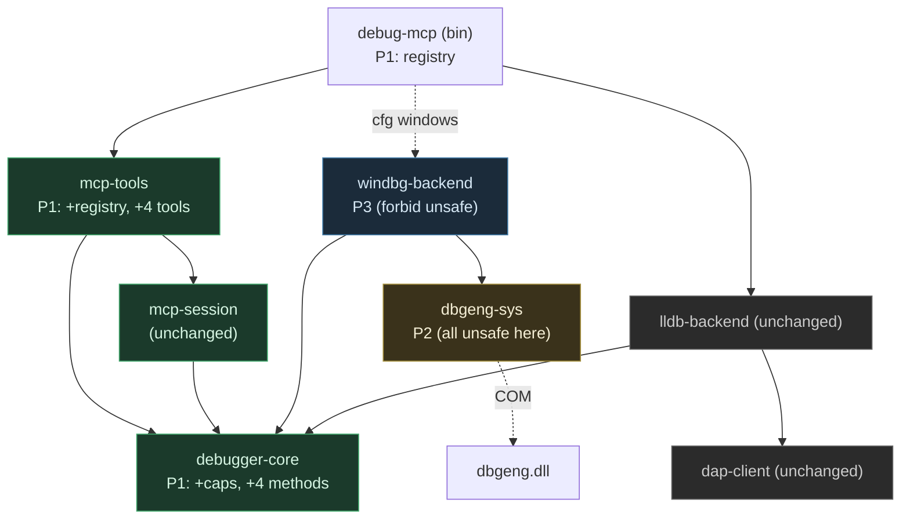
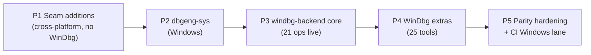

# WinDbg Backend — debug-mcp

## Overview

Implement a second debugger backend — **WinDbg (DbgEng)** — for `debug-mcp`, per the
approved [`Designs/WinDbgBackend`](../../Designs/WinDbgBackend/README.md). This is a **hard
port** of the C++ `windbg-mcp` plugin (`tmp/windbg-mcp-plugin/`, 24 tools) onto the existing
pluggable `DebuggerBackend` seam established by [`Designs/RustPort`](../../Designs/RustPort/README.md).

The deliverable: on Windows, the same agent workflows that drive lldb (the 21 neutral tools)
drive WinDbg, **plus** four new capability-gated tools — `open_crash_dump`, `attach_kernel`,
`analyze_crash`, `get_modules` — for WinDbg's distinctive value (crash dumps, kernel
debugging, `!analyze`, module listing). The 21 lldb tools stay **byte-identical**, and the
non-Windows build/test is unchanged (the WinDbg crates are `cfg(windows)`-only).

The plan adds **two crates below the seam**: `dbgeng-sys` (the *only* crate with `unsafe` —
all COM/FFI confined behind a safe synchronous `Engine`, built on Microsoft's official
`windows` crate) and `windbg-backend` (`#![forbid(unsafe_code)]` — a dedicated engine thread,
op→neutral translation, and `WinDbgFactory`). Three additive changes at/above the seam
(`debugger-core` trait methods, a `BackendRegistry` switcher, four tool handlers) unlock the
new capabilities without disturbing lldb parity.

**The hardest constraint** (from the C++ analysis): DbgEng is apartment-bound, driven
entirely from one OS thread, with blocking `WaitForEvent` loops. `windbg-backend` therefore
owns a dedicated engine thread and marshals async trait calls to it — the COM analog of
`lldb-backend`'s read-loop task.

## Architecture

Eight crates. Two are new (`windbg-backend`, `dbgeng-sys`); `debugger-core`/`mcp-tools` change
additively; `dap-client`/`lldb-backend`/`mcp-session` are untouched. The seam guarantee holds:
`mcp-tools`/`mcp-session` still depend only on `debugger-core`.

Phases are strictly sequential: P1 freezes the seam additions and the registry (and keeps the
lldb build green); P2 builds the safe `Engine`; P3 makes WinDbg drive the core 21 tools; P4
lights up the four extras; P5 closes parity gaps, ports the C++ test groups, and adds the CI
Windows lane.

> **Phase numbering:** this plan numbers phases **1–5**; the design (`Designs/WinDbgBackend`
> §Migration) numbers the same phases **0–4** (plan Phase N = design Phase N−1). The first task
> of each phase (`2.1`, `3.1`, `4.1`) carries `depends_on: []` because intra-phase ordering
> starts there — the **phase-level** `depends_on` in the README frontmatter governs the
> cross-phase gating (e.g. Phase 2 cannot start until Phase 1 completes, since `dbgeng-sys`
> returns the `debugger-core` types Phase 1 adds).

## Key Decisions

Carried from the approved design (see `Designs/WinDbgBackend` Design Decisions 1–8):

1. **`dbgeng-sys` (unsafe) + `windbg-backend` (safe)** — the `unsafe` boundary is a *crate*
   boundary (`rg unsafe crates/` hits only `dbgeng-sys/src/`); every other crate keeps
   `#![forbid(unsafe_code)]`. Built on the official `windows` crate.
2. **Dedicated engine OS thread** — one `std::thread` per connection owns the `Engine`,
   MTA-COM-initialized; async methods marshal `EngineCmd`s over a channel and `.await` a
   `oneshot` reply. No COM on a tokio worker.
3. **Capability-gated tool expansion** — 4 default-`Unsupported` trait methods; four new tools
   advertised only when a WinDbg-capable factory is registered; lldb stays byte-identical.
4. **`pause`/cancel via an interrupt flag + `InterruptHandle::SetInterrupt`** (out-of-band, not
   a queued command); the flag resets at the top of each `go()`; cross-thread `SetInterrupt` is
   the load-bearing safety assumption (R4) with a flag-only fallback.
5. **Engine-side conditional breakpoints** (map + `Evaluate @@c++`), porting the C++
   `gc`-can't-re-enter workaround; eval-fail ⇒ skip (documented footgun).
6. **Reuse the neutral `BackendEvent` stream + `OutputBuffer`** unchanged — an output sink
   forwards DbgEng output onto a `tokio::mpsc`; process exit/EOF → `Terminated`.
7. **`BackendRegistry` switcher + platform-exclusive registration** — agent selects at the
   connect points (`backend` arg → env → per-OS default: windbg on Windows, lldb elsewhere).
   Each OS registers exactly one backend at compile time (`LldbFactory` under
   `cfg(not(windows))`, `WinDbgFactory` under `cfg(windows)`); lldb-on-Windows is deferred and
   the retained switcher makes it a one-line addition later.
8. **Tests run only on the platform their backend supports.** lldb's platform-bound tests are
   Unix-gated (`subprocess.rs` = `cfg(unix)`; the `integration` feature = `cfg(all(feature =
   "integration", unix))`); WinDbg tests are `cfg(windows)` + the `integration-windbg` feature.
   lldb's pure DAP-logic (duplex/`FakeEnv`) tests stay cross-platform. CI gains a Windows lane;
   the Linux/macOS lane is untouched.

## Dependencies

- The **`windows`** crate (Microsoft official) with the DbgEng interfaces
  (`Win32_System_Diagnostics_Debug` / `Extensions`) — **R1** must confirm
  `IDebugClient5`/`Control4`/`Symbols3`/`DataSpaces4`/`Registers2`/`SystemObjects4` are
  generated (resolved in Phase 2; fall back to a hand-rolled vtable inside `dbgeng-sys` for any
  missing method).
- **Windows + Debugging Tools for Windows SDK** (`dbgeng.dll`, `ext.dll`) at runtime for the
  WinDbg crates; **R8** discovers the install root at runtime (registry/env) rather than
  hard-coding the C++ path.
- A Windows CI runner (or self-hosted/manual gate) for `integration-windbg` (**R7**); the
  cross-platform Phase-1 gates remain always-on.
- The C++ `tmp/windbg-mcp-plugin` is the **parity oracle** (kept for reference, not built); its
  `test/test_target.cpp` + `test_suite.py` groups are ported to a Rust fixture + integration
  suite.
- Open design risks to resolve during implementation: **R1** (windows-crate coverage — Phase 2),
  **R2** (uncancellable kernel `INFINITE` wait + orphaned-thread pump fix — Phases 4/5), **R3**
  (`Go` `S_FALSE` no-context — Phases 3/5), **R4** (cross-thread `SetInterrupt` — Phase 2),
  **R5** (symbol-load flakiness — Phase 2), **R6** (ASLR address-BP — Phase 5), **R8** (ext path
  — Phases 2/4).
