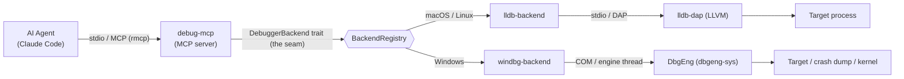
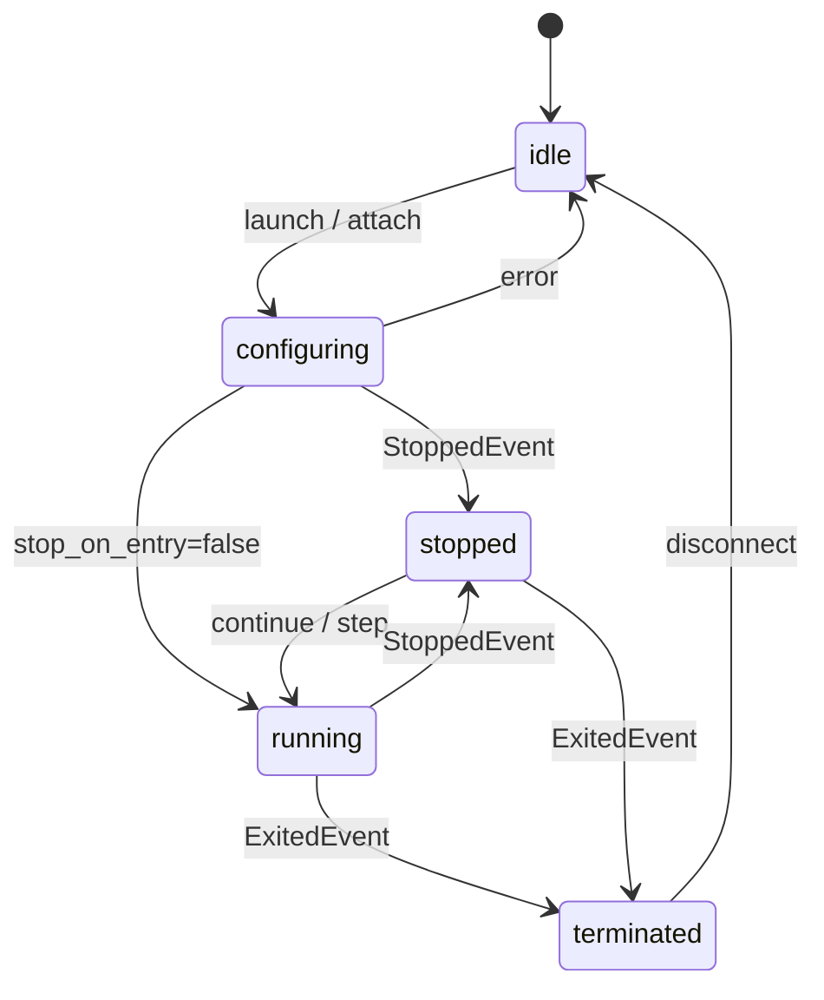

# debug-mcp

An MCP (Model Context Protocol) server that gives AI agents interactive debugging
capabilities, built on the official Rust MCP SDK ([`rmcp`](https://crates.io/crates/rmcp)).
It exposes native debugging through a **pluggable debugger backend**: the tool and session
layers depend on a debugger-neutral `DebuggerBackend` trait, so each backend plugs in below
the seam without touching the MCP tool layer.

Two backends ship, selected by platform:

- **lldb** (macOS / Linux) — drives `lldb-dap` over the Debug Adapter Protocol (DAP) on stdio.
- **WinDbg** (Windows) — drives the Windows debugger engine (DbgEng / COM) on a dedicated
  in-process engine thread, adding crash-dump analysis, kernel debugging, and `!analyze -v`.

It began as a Rust port of the Go `lldb-debug-mcp` and stays **behaviorally feature-identical**
to it for the 21 core lldb tools — same parameters, defaults, session state machine, DAP
handshake, response shapes, and error semantics — with three intentional, documented deviations
(see [Deviations from the Go server](#deviations-from-the-go-server)). The WinDbg backend adds
four capability-gated tools on top, so the surface is **21 tools on macOS/Linux and 25 on
Windows**.

> **Binary name `debug-mcp`, server name `debug`.** The published binary is `debug-mcp`
> and the advertised MCP server name is `debug` (the Go version used `lldb-debug-mcp` /
> `lldb-debug`). Backends are now pluggable, so the `lldb` prefix is reserved for the
> genuinely lldb-bound pieces (the lldb backend crate and lldb-dap detection). MCP clients
> that namespace tools by server name should use `debug`.

## Architecture



The server is a Cargo workspace of eight crates — six neutral/lldb crates plus two
`cfg(windows)` WinDbg crates below the seam — split along the `DebuggerBackend` boundary so
the tool/session crates cannot reach DAP-, lldb-, or DbgEng-specific code:

| Crate | Role | Notes |
|-------|------|-------|
| `debugger-core` | contract | `DebuggerBackend` + `BackendFactory` traits, `BackendCapabilities`, neutral types, `BackendEvent`, `BackendError`. Leaf crate — **no** `tokio`/`rmcp`/DAP/DbgEng dependency. |
| `dap-client` | generic DAP transport | Content-Length framing, sequence correlation, the pending-request map, the read loop, the stop waiter. |
| `lldb-backend` | lldb backend (macOS/Linux) | `LldbBackend` (launch/attach handshake, lldb-dap arg shapes, repl-mode/backtick) + `LldbFactory` (detect → spawn → connect). Built on `dap-client`. |
| `dbgeng-sys` *(`cfg(windows)`)* | confined COM/FFI | the **only** crate with `unsafe`: all DbgEng COM/FFI confined behind a safe, synchronous `Engine`, built on the `windows` crate. |
| `windbg-backend` *(`cfg(windows)`)* | WinDbg backend (Windows) | `#![forbid(unsafe_code)]`: a dedicated MTA-COM engine thread + `WinDbgBackend`/`WinDbgFactory`; op→neutral translation. Built on `dbgeng-sys`. |
| `mcp-session` | session | `SessionManager`: state machine (incl. the crash-dump `is_dump` flag), breakpoint tracking, frame-map cache, output buffer. Depends only on `debugger-core`. |
| `mcp-tools` | tool layer | the tool handlers, `BackendRegistry` (the runtime backend switcher), `Args` accessor, response builders, `flatten_variables`, hex-dump/output formatters, the rmcp `ServerHandler`. Depends only on `debugger-core` + `mcp-session` (+ `rmcp`). |
| `debug-mcp` | binary | `main`: build a `BackendRegistry`, register the platform's backend (`LldbFactory` under `cfg(not(windows))`, `WinDbgFactory` under `cfg(windows)`), serve over stdio via rmcp. |

**Seam guarantee.** `mcp-tools` and `mcp-session` depend on `debugger-core` only — they
cannot name a DAP, lldb, or DbgEng type. Only the binary depends on a concrete backend crate,
and only to register a `dyn BackendFactory` into the `BackendRegistry`. Adding the WinDbg
backend required **zero changes above the seam** — exactly the additive shape the design
promised. (The `seam` Make target enforces the dependency boundary; the `unsafe-gate` target
enforces that `unsafe` appears only under `crates/dbgeng-sys/`.)

**Platform-exclusive backends.** lldb is the macOS/Linux backend; WinDbg is the Windows
backend. The binary registers exactly one factory per OS (lldb-on-Windows is deferred), and
each backend's platform-bound tests run only on that platform. The `BackendRegistry` switcher
is retained so a second backend can be registered per-OS later as a one-line addition; today
`launch`/`attach` honor an optional `backend` arg, then `DEBUG_BACKEND`, then the per-OS
default (`windbg` on Windows, `lldb` elsewhere).

### Session state machine



## Requirements

- Rust (stable) for building; a nightly toolchain + `rust-src` only for the optional
  ThreadSanitizer run.
- A debugger runtime for your platform (see below).
- A C compiler only for building the integration-test fixtures
  (`gcc`/`clang` on macOS/Linux; MSVC `cl` on Windows).

### macOS / Linux — lldb-dap

Needs `lldb-dap` (LLVM 18+) or `lldb-vscode` (older LLVM) at runtime.

| Platform | Command |
|----------|---------|
| macOS | `xcode-select --install` |
| Ubuntu / Debian | `sudo apt install lldb` |
| Fedora | `sudo dnf install lldb` |
| Arch Linux | `sudo pacman -S lldb` |

The server auto-detects the binary using this fallback chain (matching the Go version):

1. `LLDB_DAP_PATH` environment variable
2. `lldb-dap` in PATH
3. `lldb-dap-{20..15}` in PATH (versioned, prefers higher)
4. `lldb-vscode` in PATH (older LLVM — `run_command` falls back to backtick-prefixing)
5. macOS only: `xcrun --find lldb-dap`

Set `LLDB_DAP_PATH` if auto-detection doesn't find it. The variable is read lazily at the
first `launch`/`attach`, never at startup.

### Windows — WinDbg / DbgEng

The debugger engine (`dbgeng.dll`) is **bundled with Windows** (in `System32`), so core
debugging — launch, attach, breakpoints, stepping, inspection, memory, crash dumps — works
out of the box with no extra install.

The **Debugging Tools for Windows** (part of the Windows SDK / WDK) are required only for the
extension-backed commands — `analyze_crash` (`!analyze -v`) and `run_command("!...")`. The
backend discovers the extension path at runtime (registry `KitsRoot10` → `WindowsSdkDir` →
the default install path) and loads `ext.dll`; if the full tools are not installed,
`analyze_crash` degrades gracefully (it returns the engine's `No export analyze found` rather
than failing). Symbols resolve via the standard `_NT_SYMBOL_PATH` / a `srv*` cache.

## Build

```bash
cargo build --release -p debug-mcp
# binary at: <CARGO_TARGET_DIR or target>/release/debug-mcp
```

## How to use with Claude Code

### 1. Configure the MCP server

```bash
claude mcp add debug -- /path/to/debug-mcp
```

Or add it manually to your MCP settings (`.claude/settings.json` or project-level):

```json
{
  "mcpServers": {
    "debug": {
      "command": "/path/to/debug-mcp"
    }
  }
}
```

If `lldb-dap` isn't on your PATH, pass the environment variable:

```json
{
  "mcpServers": {
    "debug": {
      "command": "/path/to/debug-mcp",
      "env": {
        "LLDB_DAP_PATH": "/usr/lib/llvm-18/bin/lldb-dap"
      }
    }
  }
}
```

### Claude Desktop

Add to `~/Library/Application Support/Claude/claude_desktop_config.json` (macOS) or
`%APPDATA%/Claude/claude_desktop_config.json` (Windows):

```json
{
  "mcpServers": {
    "debug": {
      "command": "/path/to/debug-mcp"
    }
  }
}
```

### 2. Compile your program with debug info

The target binary must be compiled with debug symbols. For C/C++:

```bash
gcc -g -O0 -o myprogram myprogram.c   # or clang -g -O0 ...
```

For Rust, `cargo build` (debug profile) includes symbols by default.

### 3. Ask Claude to debug

Example prompts:

- *"Launch `./myprogram` and set a breakpoint at main.c line 42, then continue and show me the local variables when it hits"*
- *"Debug the segfault in `./crash_repro` — find where it crashes and inspect the state"*
- *"Attach to PID 12345 and get a backtrace of all threads"*

### Tips

- **Breakpoints before launch**: set breakpoints before `launch` — they are buffered and
  flushed automatically during the DAP handshake.
- **`run_command` escape hatch**: `run_command` executes any LLDB command directly
  (e.g. `run_command(command="watchpoint set variable x")`).
- **Concurrent pause**: while `continue` is blocking, a separate `pause` tool call can
  interrupt execution.
- **Output capture**: program stdout/stderr is buffered and merged into `continue`/`step_*`
  responses; `read_output` drains any additional output.

## Agent plugins (Claude Code / OpenCode / Codex)

The repo ships one plugin for three agent harnesses. The canonical plugin is the
Claude Code tree at `plugin/`; the OpenCode and Codex variants are **generated**
trees, committed and drift-gated (`make all` runs `plugins-check`).

| Harness | Install from | Form |
|---|---|---|
| **Claude Code** | `plugin/` (`claude --plugin-dir ./plugin`, or the marketplace manifest at `.claude-plugin/marketplace.json`) | 6 `debug-mcp-*` skills + a print-debugging nudge hook |
| **OpenCode** | `.opencode-plugin/` | same 6 skills via skill discovery (skills-only) |
| **Codex** | `.codex-plugin/` | same 6 skills via a marketplace carrying the tree (skills-only) |

The skills are generic, model-loaded ("modal") skills selected by description
match — session lifecycle, breakpoints, execution, inspection, low-level
memory/disassembly/raw-commands, and WinDbg crash-dump/kernel/module work. All
three harnesses need the `debug` MCP server registered under the name `debug`
(see each tree's `README.md`).

To change the plugin, edit `plugin/` (skills) or `plugin/README.portable.md`
(the generated trees' README), then run `make plugins` and commit the
regenerated `.opencode-plugin/` + `.codex-plugin/`. Never edit the generated
trees by hand.

## Tools reference

The **21 core tools** below are available on every platform and are byte-identical to the Go
server. On Windows, four additional **WinDbg-only tools** are advertised (25 total) — see
[WinDbg-only tools](#windbg-only-tools-windows).

### Session management
| Tool | Description | Parameters |
|------|-------------|------------|
| `launch` | Launch a program under the debugger | `program` (required), `args`, `cwd`, `env`, `stop_on_entry`, `backend` |
| `attach` | Attach to a running process | `pid` or `wait_for`, `backend` |
| `disconnect` | End the debug session | `terminate` (default true) |

> The optional `backend` arg (`"lldb"` / `"windbg"`) on `launch`/`attach` is additive — omit
> it to use the per-OS default. `status` reports the active backend and the available backends.

### Breakpoints
| Tool | Description | Parameters |
|------|-------------|------------|
| `set_breakpoint` | Set a source-line breakpoint | `file` (required), `line` (required), `condition` |
| `set_function_breakpoint` | Break on function entry | `name` (required), `condition` |
| `remove_breakpoint` | Remove a breakpoint | `breakpoint_id` (required) |
| `list_breakpoints` | List all breakpoints | — |

### Execution control
| Tool | Description | Parameters |
|------|-------------|------------|
| `continue` | Resume execution (blocks until next stop) | `thread_id` |
| `step_over` | Step over current line | `thread_id`, `granularity` (line/instruction) |
| `step_into` | Step into function call | `thread_id`, `granularity` (line/instruction) |
| `step_out` | Step out of current function | `thread_id` |
| `pause` | Pause all threads | — |

### Inspection
| Tool | Description | Parameters |
|------|-------------|------------|
| `status` | Session state and stop info | — |
| `backtrace` | Call stack for a thread | `thread_id`, `levels` |
| `threads` | List all threads | — |
| `variables` | Variables in scope (recursive flattening) | `frame_index`, `scope` (local/global/register), `depth`, `filter` |
| `evaluate` | Evaluate an expression | `expression` (required), `frame_index` |
| `read_output` | Drain captured stdout/stderr | — |

### Advanced
| Tool | Description | Parameters |
|------|-------------|------------|
| `read_memory` | Read raw memory (hex dump) | `address` (required), `count` (required) |
| `disassemble` | Disassemble at address or PC | `address`, `instruction_count` (default 20) |
| `run_command` | Execute any backend command (LLDB command / WinDbg command incl. `!extensions`) | `command` (required) |

### WinDbg-only tools (Windows)

Advertised only when a WinDbg-capable backend is registered (so the surface is exactly 21 on
macOS/Linux). On an active lldb session they return a clear `not supported by the lldb backend`
tool-error.

| Tool | Description | Parameters |
|------|-------------|------------|
| `open_crash_dump` | Open a crash/minidump for post-mortem analysis (a `stopped`, non-resumable session) | `dump_path` (required) |
| `attach_kernel` | Attach to a kernel target over KDNET | `connection` (required, `net:port=,key=`) |
| `analyze_crash` | Run `!analyze -v` and return the report | — |
| `get_modules` | List loaded modules (name, base, size, symbol status) | — |

## Deviations from the Go server

The Go implementation is the parity oracle. There are exactly three intentional, documented
deviations from it:

1. **Server identity.** The binary is `debug-mcp` (was `lldb-debug-mcp`) and the advertised
   MCP server name is `debug` (was `lldb-debug`), reflecting that backends are now
   pluggable. The DAP `clientID` sent to lldb-dap remains `lldb-debug-mcp` (an
   lldb-dap-facing identifier below the seam, unchanged).
2. **`disassemble` default `instruction_count` = 20.** The design doc and README document
   20; the Go *code* defaults to 10, treated as a latent bug. The Rust port aligns to the
   documented intent (20). This is isolated to one default and its parity test.
3. **Numeric-validation policy (tool-boundary guards).** Go is permissive: it coerces
   `float64 → int` and forwards clearly-invalid values straight to lldb-dap. Since this is a
   debugger-control surface exposed to agents, the Rust port validates a *minimal* set of
   clearly-invalid values at the tool boundary with predictable errors instead:
   - `read_memory` `count` must be a positive integer → `'count' must be a positive integer`;
   - an explicit, numeric `thread_id` (on `continue`/`step_*`/`backtrace`) must be positive →
     `'thread_id' must be a positive integer` (an absent or non-numeric `thread_id` still
     falls back to the last-stopped thread, then `1` — Go parity);
   - `set_breakpoint` `line` must be a positive integer after truncation →
     `'line' must be a positive integer`.

   Valid values keep Go's `float64 → int` truncation (e.g. `line` `4.7 → 4`), and large
   positive values are still forwarded unchanged (no caps are added). No other numeric
   parameter is affected.

   Relatedly (a robustness improvement on the *error* path, not a deviation on the success
   path): the stopped-state breakpoint mutations (`set_breakpoint`,
   `set_function_breakpoint`, `remove_breakpoint`) are now **transactional** — the session's
   tracked breakpoint list is committed only after lldb-dap confirms the change, so a backend
   rejection leaves the tracked state unchanged. The success-path output is identical to Go.

Everything else is byte-for-byte behavior parity at the level of observable MCP output
(field names, types, presence rules, values, and error strings). Object key order and
whitespace may differ (structural JSON parity).

### WinDbg backend notes

These extend the frozen Go-parity surface; the 21 lldb tools stay byte-identical. Below the
seam, the WinDbg backend differs from the lldb backend in a few documented ways (full list in
`CLAUDE.md`):

- **Additive surface.** The optional `backend` arg on `launch`/`attach`, the additive
  `backend`/`available_backends` fields on `status`, and the four capability-gated tools above
  are advertised only when a WinDbg-capable backend is registered (so non-Windows = exactly 21).
- **Crash-dump sessions** are `stopped` with an `is_dump` flag; `continue`/`step_*` reject them
  with `cannot continue a crash-dump session`.
- **Address breakpoints.** A bare `0x<addr>` passed to `set_function_breakpoint` is rejected
  (it would be ASLR-misplaced when re-flushed on relaunch); use `module!sym` (rebase-stable) or
  `run_command("bp <addr>")`. Conditional breakpoints whose condition fails to evaluate
  (out-of-scope/typo) are silently skipped (DbgEng parity).
- **Output / evaluate.** Debuggee stdout is not surfaced through `read_output` (DbgEng output
  callbacks carry engine output, not the child's `printf`); `evaluate` runs in the current
  frame. `analyze_crash`/`!`-commands need the Debugging Tools installed (graceful degradation
  otherwise).

## Development

The gates split into a hermetic lint/build gate, the live per-platform integration gates, and
the supply-chain gates — `make all` is **not** full coverage on its own:

- **`make all` — the hermetic gate.** Format check, build, `clippy -D warnings` (no
  `#[allow]` — warnings are fixed at the source), unit tests, the `seam` check, and the
  `unsafe-gate` (asserts `unsafe` appears only under `crates/dbgeng-sys/`). It needs no
  debugger and runs anywhere. Note it does **not** exercise the live runtime path: the
  integration scenarios are behind feature flags and compile as *zero tests* under the
  default workspace test command, so a green `make all` does not prove live debugging.
- **`make integration` — the live lldb-dap gate (macOS/Linux).** Builds `debug-mcp`, then runs
  the ported integration scenarios + the golden cross-check + the differential lane against
  real lldb-dap.
- **`make integration-windbg` — the live WinDbg gate (Windows).** Builds `debug-mcp`, then runs
  the WinDbg integration suite (Normal / Attach / Pause / Crash / Dump / Error / shape groups)
  against real DbgEng + the `testdata/win/test_target.exe` fixture.
- **`make ready` — the pre-ship gate.** The full test suite plus the supply-chain gates:
  `make audit` (cargo-audit — RustSec advisory/CVE scan) and `make deny` (cargo-deny — the
  license allow-list, banned/duplicate crates, and source policy in `deny.toml`).

```bash
# Hermetic gate: format, build, lint, unit tests, seam, unsafe-gate.
make all
# or individually:
make fmt-check build clippy test seam unsafe-gate

# Unit tests only (hermetic; integration scenarios compile as zero tests here).
cargo test --workspace

# Live integration — macOS/Linux (lldb-dap) + differential-parity suite.
# Requires lldb-dap + the compiled C fixtures. Each test SKIPS cleanly (logs + passes)
# when lldb-dap or a fixture is absent. Single-threaded (the suites share lldb-dap and
# the crash scenarios kill subprocesses by pid).
make -C testdata                 # build the C fixtures once
make integration

# Live integration — Windows (WinDbg / DbgEng).
# Build the fixture once from a VS x64 Native Tools prompt: testdata\win\build.bat
make integration-windbg

# Supply-chain gates (cargo-audit + cargo-deny).
cargo install cargo-audit cargo-deny   # once
make audit deny                        # or: make ready  (= test + audit + deny)

# ThreadSanitizer over the dap-client concurrency tests (nightly + rust-src; Linux/macOS).
make tsan
```

The release profile is fully optimized for shippable binaries — `opt-level = 3`, fat LTO,
`codegen-units = 1`, and stripped symbols (`panic` stays `unwind`, which the WinDbg engine
thread's `catch_unwind` teardown relies on):

```bash
cargo build --release -p debug-mcp   # the published binary: debug-mcp
```

The differential-parity harness (`mcp-tools/tests/integration_differential.rs`) replays
identical MCP tool sequences against `debug-mcp` and the Go `lldb-debug-mcp` over stdio and
diffs the parsed JSON structurally, asserting the deviations above explicitly. It needs a
**Go oracle** — provided via `GO_DEBUG_MCP_BIN` (an explicit path) or `lldb-debug-mcp` on
PATH. Behavior when the oracle is absent:

- by default it **skips cleanly**, logging `SKIPPED (NOT compared)`, and the always-on
  golden cross-check still validates the documented response shapes against `debug-mcp`;
- set `REQUIRE_GO_DIFFERENTIAL=1` to make the absence of the oracle (or of lldb-dap / the
  Rust binary) a **hard failure** — so a CI/merge job can't pass while the strongest parity
  lane silently no-ops. CI (`.github/workflows/ci.yml`) builds the Go oracle from the `main`
  branch and runs this lane with the gate set.

## License

MIT
